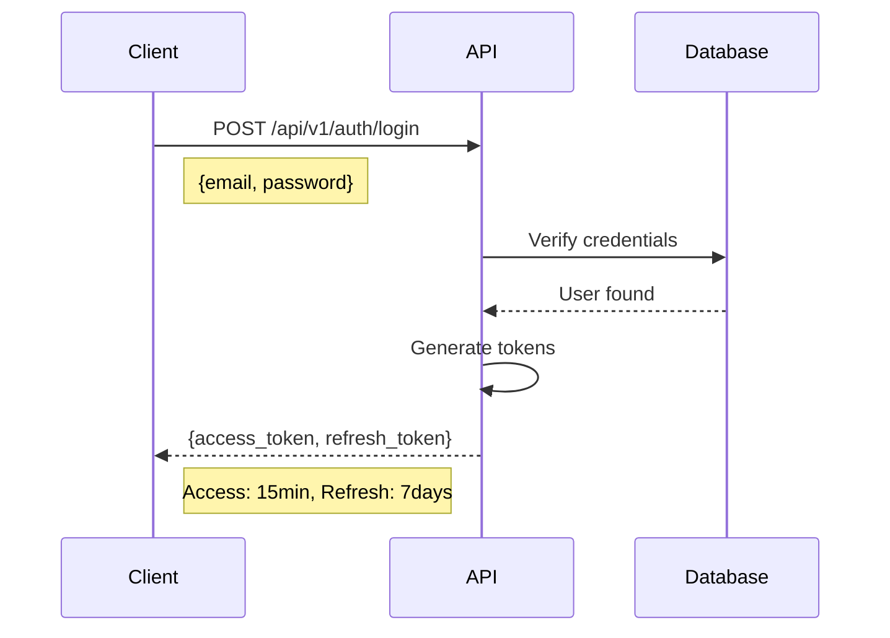
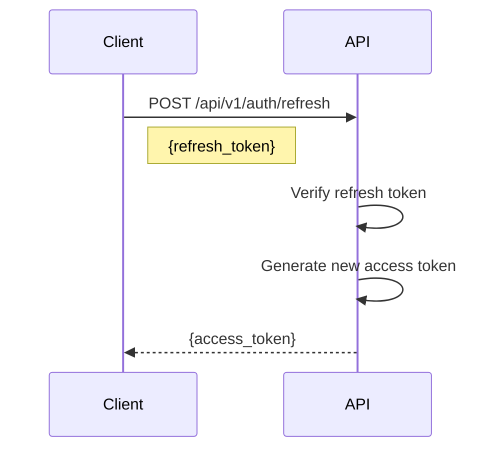
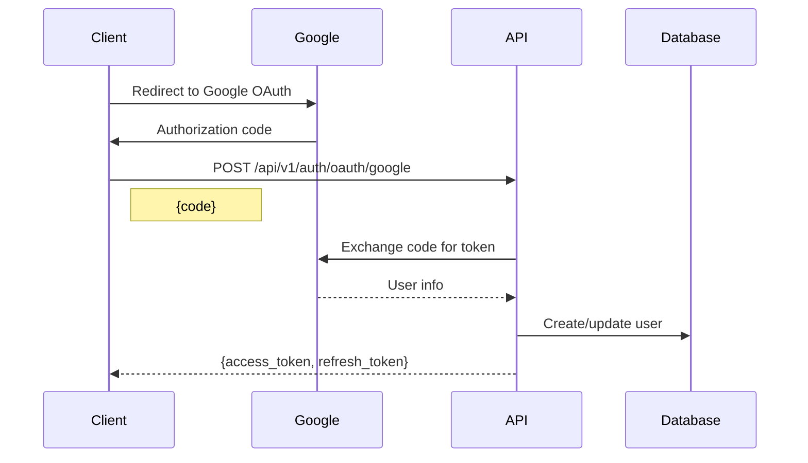

# API Development Guide

This guide covers best practices and patterns for developing APIs in the Coinfrs project.

## API Structure

### URL Patterns
All API endpoints follow RESTful conventions:
```
/api/v1/{resource}           # Collection
/api/v1/{resource}/{id}      # Single resource
/api/v1/{resource}/{id}/{sub-resource}  # Nested resource
```

### HTTP Methods
- `GET` - Retrieve resource(s)
- `POST` - Create new resource
- `PUT` - Update entire resource
- `PATCH` - Partial update
- `DELETE` - Remove resource

### Examples
```
GET    /api/v1/portfolios              # List all portfolios
POST   /api/v1/portfolios              # Create new portfolio
GET    /api/v1/portfolios/123          # Get specific portfolio
PUT    /api/v1/portfolios/123          # Update portfolio
DELETE /api/v1/portfolios/123          # Delete portfolio
GET    /api/v1/portfolios/123/entities # List entities in portfolio
```

## Request/Response Format

### Request Structure
```python
# Pydantic schema example
class PortfolioCreateRequest(BaseModel):
    name: str = Field(..., min_length=1, max_length=100)
    description: Optional[str] = Field(None, max_length=500)
    portfolio_type: PortfolioType
    currency: str = Field(default="USD", regex="^[A-Z]{3}$")
    
    class Config:
        schema_extra = {
            "example": {
                "name": "Main Trading Portfolio",
                "description": "Primary portfolio for spot trading",
                "portfolio_type": "company",
                "currency": "USD"
            }
        }
```

### Success Response
```json
{
  "success": true,
  "data": {
    "id": "550e8400-e29b-41d4-a716-446655440000",
    "name": "Main Trading Portfolio",
    "description": "Primary portfolio for spot trading",
    "portfolio_type": "company",
    "currency": "USD",
    "created_at": "2025-07-23T10:00:00Z",
    "updated_at": "2025-07-23T10:00:00Z"
  },
  "meta": {
    "timestamp": "2025-07-23T10:00:00Z",
    "request_id": "req_550e8400-e29b-41d4-a716-446655440001",
    "version": "1.0"
  }
}
```

### Error Response
```json
{
  "success": false,
  "error": {
    "code": "VALIDATION_ERROR",
    "message": "Invalid request data",
    "details": {
      "name": ["Field is required"],
      "currency": ["Invalid currency code"]
    }
  },
  "meta": {
    "timestamp": "2025-07-23T10:00:00Z",
    "request_id": "req_550e8400-e29b-41d4-a716-446655440001"
  }
}
```

## Authentication Flow

### 1. Email/Password Login


### 2. Token Refresh


### 3. Google OAuth


## Creating New Endpoints

### 1. Define Pydantic Schemas
```python
# app/schemas/portfolio.py
from pydantic import BaseModel, Field
from typing import Optional
from datetime import datetime
from uuid import UUID

class PortfolioBase(BaseModel):
    name: str = Field(..., min_length=1, max_length=100)
    description: Optional[str] = None
    portfolio_type: PortfolioType
    currency: str = "USD"

class PortfolioCreate(PortfolioBase):
    pass

class PortfolioUpdate(BaseModel):
    name: Optional[str] = None
    description: Optional[str] = None
    currency: Optional[str] = None

class PortfolioResponse(PortfolioBase):
    id: UUID
    user_id: UUID
    created_at: datetime
    updated_at: datetime
    
    class Config:
        orm_mode = True
```

### 2. Create API Endpoint
```python
# app/api/v1/portfolios.py
from fastapi import APIRouter, Depends, HTTPException, status
from sqlmodel import Session
from typing import List
from uuid import UUID

from app.db.session import get_session
from app.api.deps import get_current_user
from app.schemas.portfolio import PortfolioCreate, PortfolioResponse
from app.models.portfolio import Portfolio

router = APIRouter()

@router.post("/", response_model=PortfolioResponse, status_code=status.HTTP_201_CREATED)
def create_portfolio(
    portfolio: PortfolioCreate,
    session: Session = Depends(get_session),
    current_user: User = Depends(get_current_user)
):
    """Create a new portfolio for the current user."""
    db_portfolio = Portfolio(
        **portfolio.dict(),
        user_id=current_user.id
    )
    session.add(db_portfolio)
    session.commit()
    session.refresh(db_portfolio)
    return db_portfolio

@router.get("/", response_model=List[PortfolioResponse])
def list_portfolios(
    skip: int = 0,
    limit: int = 100,
    session: Session = Depends(get_session),
    current_user: User = Depends(get_current_user)
):
    """List all portfolios for the current user."""
    portfolios = session.query(Portfolio).filter(
        Portfolio.user_id == current_user.id,
        Portfolio.deleted_at.is_(None)
    ).offset(skip).limit(limit).all()
    return portfolios
```

### 3. Add Router to Main App
```python
# app/api/v1/__init__.py
from fastapi import APIRouter
from app.api.v1 import auth, portfolios, entities, datasources

api_router = APIRouter()

api_router.include_router(auth.router, prefix="/auth", tags=["auth"])
api_router.include_router(portfolios.router, prefix="/portfolios", tags=["portfolios"])
api_router.include_router(entities.router, prefix="/entities", tags=["entities"])
api_router.include_router(datasources.router, prefix="/datasources", tags=["datasources"])
```

## Error Handling

### Custom Exceptions
```python
# app/api/errors.py
from fastapi import HTTPException, status

class NotFoundError(HTTPException):
    def __init__(self, resource: str, id: str):
        super().__init__(
            status_code=status.HTTP_404_NOT_FOUND,
            detail={
                "code": "NOT_FOUND",
                "message": f"{resource} with id {id} not found"
            }
        )

class ValidationError(HTTPException):
    def __init__(self, message: str, details: dict = None):
        super().__init__(
            status_code=status.HTTP_400_BAD_REQUEST,
            detail={
                "code": "VALIDATION_ERROR",
                "message": message,
                "details": details or {}
            }
        )

class AuthenticationError(HTTPException):
    def __init__(self, message: str = "Invalid authentication credentials"):
        super().__init__(
            status_code=status.HTTP_401_UNAUTHORIZED,
            detail={
                "code": "AUTHENTICATION_ERROR",
                "message": message
            },
            headers={"WWW-Authenticate": "Bearer"}
        )
```

### Global Exception Handler
```python
# app/main.py
from fastapi import FastAPI, Request
from fastapi.responses import JSONResponse
from fastapi.exceptions import RequestValidationError

app = FastAPI()

@app.exception_handler(RequestValidationError)
async def validation_exception_handler(request: Request, exc: RequestValidationError):
    return JSONResponse(
        status_code=422,
        content={
            "success": False,
            "error": {
                "code": "VALIDATION_ERROR",
                "message": "Invalid request data",
                "details": exc.errors()
            }
        }
    )
```

## Pagination

### Query Parameters
```python
class PaginationParams(BaseModel):
    skip: int = Field(0, ge=0, description="Number of items to skip")
    limit: int = Field(100, ge=1, le=1000, description="Number of items to return")
    
@router.get("/", response_model=PaginatedResponse[PortfolioResponse])
def list_portfolios(
    pagination: PaginationParams = Depends()
):
    total = session.query(Portfolio).count()
    items = session.query(Portfolio).offset(pagination.skip).limit(pagination.limit).all()
    
    return PaginatedResponse(
        items=items,
        total=total,
        skip=pagination.skip,
        limit=pagination.limit
    )
```

### Paginated Response
```json
{
  "success": true,
  "data": {
    "items": [...],
    "total": 150,
    "skip": 0,
    "limit": 100,
    "has_more": true
  }
}
```

## Testing APIs

### Unit Test Example
```python
# tests/api/test_portfolios.py
import pytest
from fastapi.testclient import TestClient
from app.main import app

client = TestClient(app)

def test_create_portfolio(auth_headers):
    response = client.post(
        "/api/v1/portfolios",
        json={
            "name": "Test Portfolio",
            "portfolio_type": "company",
            "currency": "USD"
        },
        headers=auth_headers
    )
    assert response.status_code == 201
    data = response.json()
    assert data["success"] is True
    assert data["data"]["name"] == "Test Portfolio"
```

### Integration Test Example
```python
@pytest.mark.integration
def test_portfolio_workflow(auth_headers, db_session):
    # Create portfolio
    create_response = client.post("/api/v1/portfolios", ...)
    portfolio_id = create_response.json()["data"]["id"]
    
    # Add entity
    entity_response = client.post(f"/api/v1/portfolios/{portfolio_id}/entities", ...)
    
    # Verify in database
    portfolio = db_session.query(Portfolio).filter_by(id=portfolio_id).first()
    assert portfolio is not None
    assert len(portfolio.entities) == 1
```

## API Documentation

### OpenAPI Annotations
```python
@router.post(
    "/",
    response_model=PortfolioResponse,
    status_code=status.HTTP_201_CREATED,
    summary="Create a new portfolio",
    description="Create a new portfolio for the authenticated user",
    response_description="The created portfolio",
    responses={
        201: {"description": "Portfolio created successfully"},
        400: {"description": "Invalid request data"},
        401: {"description": "Not authenticated"},
        409: {"description": "Portfolio with this name already exists"}
    }
)
```

### Example Documentation
Access the auto-generated documentation at:
- Swagger UI: http://localhost:8000/docs
- ReDoc: http://localhost:8000/redoc
- OpenAPI JSON: http://localhost:8000/openapi.json

## Best Practices

1. **Use Dependency Injection**: For database sessions, current user, etc.
2. **Validate Early**: Use Pydantic for request validation
3. **Return Consistent Responses**: Always use the standard response format
4. **Handle Errors Gracefully**: Return appropriate status codes and messages
5. **Document Everything**: Use OpenAPI annotations
6. **Test Thoroughly**: Unit and integration tests for all endpoints
7. **Version Your API**: Start with v1 and plan for future versions
8. **Use Async When Beneficial**: For I/O operations
9. **Implement Rate Limiting**: Protect against abuse
10. **Log Appropriately**: Request IDs, errors, and important events

---

This guide should help you create consistent, well-documented APIs. Always refer to existing endpoints for examples and patterns.